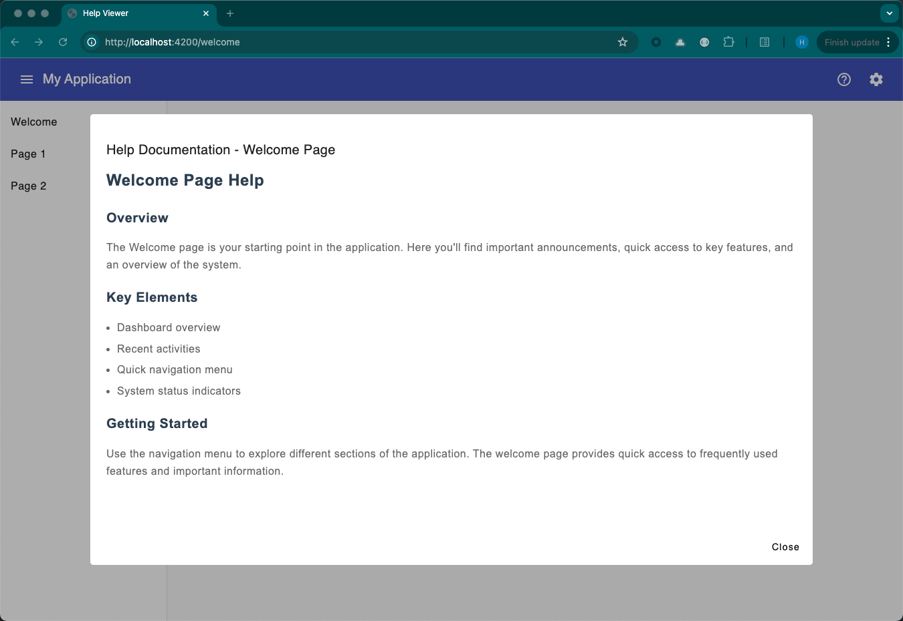
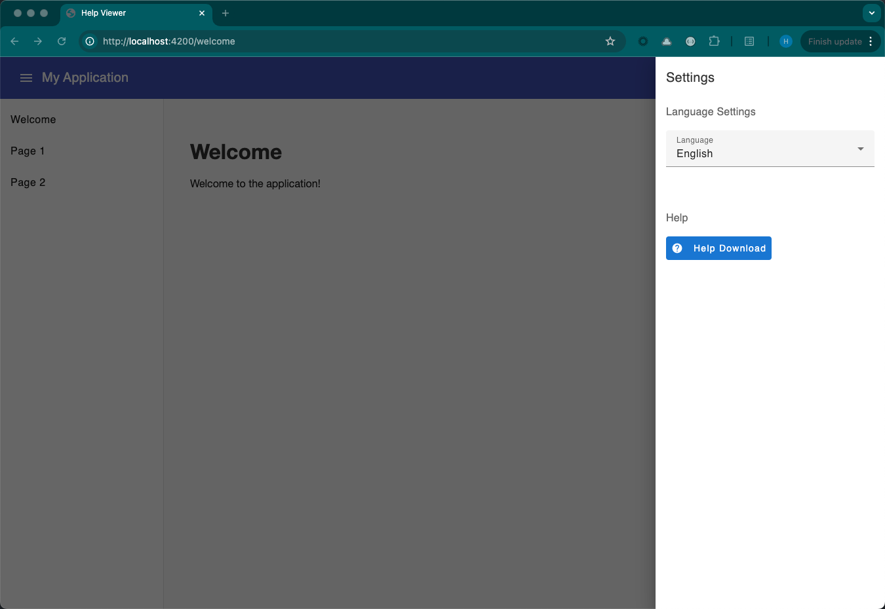
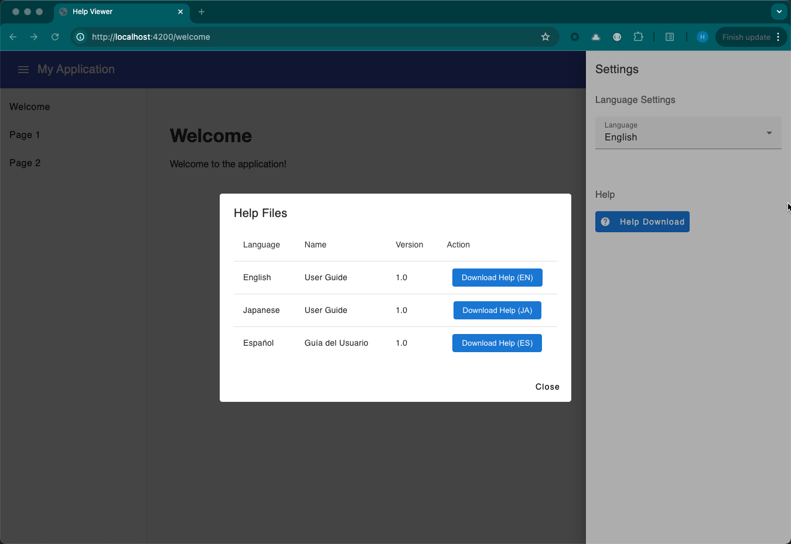

# MyHelp

A full-stack web application built with Spring Boot and Angular.

## Project Structure

```
myhelp/
├── backend/                    # Spring Boot backend application
│   ├── src/
│   │   ├── main/
│   │   │   ├── java/         # Java source files
│   │   │   │   └── com/
│   │   │   │       └── myhelp/
│   │   │   │           ├── config/      # Configuration classes
│   │   │   │           ├── controller/  # REST controllers
│   │   │   │           ├── model/       # Data models
│   │   │   │           ├── repository/  # Data access layer
│   │   │   │           └── service/     # Business logic
│   │   │   └── resources/    # Application properties and static resources
│   │   └── test/            # Test files
│   └── pom.xml              # Maven configuration
│
├── frontend/                  # Angular frontend application
│   ├── src/
│   │   ├── app/
│   │   │   ├── common/      # Shared components and utilities
│   │   │   ├── components/  # Reusable UI components
│   │   │   ├── dialogs/     # Modal dialog components
│   │   │   ├── pages/       # Page components
│   │   │   ├── pipes/       # Angular pipes
│   │   │   └── services/    # Angular services
│   │   ├── assets/         # Static assets
│   │   └── environments/   # Environment configurations
│   └── package.json        # NPM configuration
│
├── help-files/              # Documentation and help files
└── repository/             # Additional resources
```

### Backend Structure Details

The backend follows a standard Spring Boot architecture with the following key components:

- **Config**: Contains application configuration classes
- **Controller**: REST API endpoints and request handling
- **Model**: Data models and entities
- **Repository**: Data access layer using Spring Data JPA
- **Service**: Business logic implementation

### Frontend Structure Details

The frontend follows Angular best practices with a modular structure:

- **Common**: Shared utilities, interfaces, and constants
- **Components**: Reusable UI components
- **Dialogs**: Modal dialog components for user interactions
- **Pages**: Main page components
- **Pipes**: Custom Angular pipes for data transformation
- **Services**: Angular services for API communication and state management

## Prerequisites

- Java 17 or higher
- Node.js 18.x or higher
- npm 9.x or higher
- Angular CLI 19.x or higher

## Backend Setup

1. Navigate to the backend directory:
   ```bash
   cd backend
   ```

2. Build the project using Maven:
   ```bash
   ./mvnw clean install
   ```

3. Run the Spring Boot application:
   ```bash
   ./mvnw spring-boot:run
   ```

The backend server will start on `http://localhost:8080`.

## Frontend Setup

1. Navigate to the frontend directory:
   ```bash
   cd frontend
   ```

2. Install dependencies:
   ```bash
   npm install
   ```

3. Start the development server:
   ```bash
   ng serve
   ```

The frontend application will be available at `http://localhost:4200`.

## Development

- Backend API documentation is available at `http://localhost:8080/swagger-ui.html` when running in development mode
- Frontend development server includes hot-reload for instant feedback
- Proxy configuration is set up to forward API requests to the backend server

## Building for Production

### Backend
```bash
cd backend
./mvnw clean package
```

### Frontend
```bash
cd frontend
ng build --configuration production
```

## Contributing

1. Create a new branch for your feature
2. Make your changes
3. Submit a pull request

## License

This project is licensed under the MIT License - see the LICENSE file for details. 

## Screenshots



